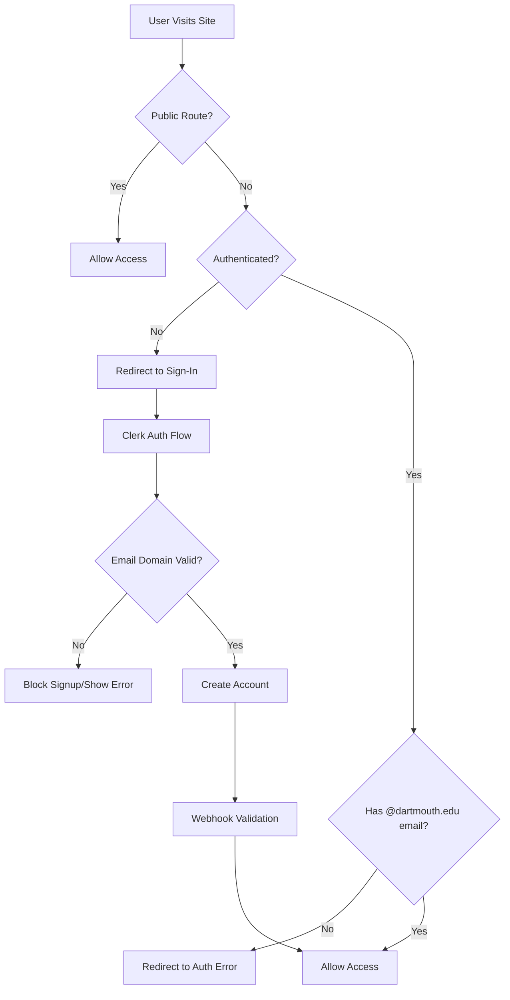

# Authentication System Documentation

## 🔐 Overview

Find Your Path uses **Clerk** for authentication with **strict @dartmouth.edu email validation** to ensure only Dartmouth community members can access protected features.

## 🏗️ Architecture



## 📧 Email Validation System

### Client-Side Validation
- **Location**: Sign-up/Sign-in pages show warnings
- **Purpose**: User guidance only
- **Security**: ❌ Can be bypassed

### Server-Side Validation
- **Location**: `middleware.ts` 
- **Triggers**: Every protected route access
- **Action**: Redirects non-Dartmouth emails to `/auth-error`
- **Security**: ✅ Cannot be bypassed

### Webhook Validation
- **Location**: `/api/webhooks/clerk/route.ts`
- **Triggers**: User creation, updates, sessions
- **Purpose**: Real-time monitoring and logging
- **Security**: ✅ Server-side only

## 🛣️ Routes & Access Control

### Public Routes (No Authentication)
```
/ (homepage)
/sign-in/**
/sign-up/**  
/why (about page)
/opportunities (browse only)
/api/webhooks/**
```

### Protected Routes (Authentication Required)
```
/chat (AI assistant)
/opportunities/submit (create opportunities)
/dev (development tools)
/saved (user favorites)
/browse (personalized search)
```

### Special Routes
```
/auth-error (invalid email domain)
/onboarding (future: user setup)
```

## 🔧 Configuration

### Environment Variables
```bash
# Public key - safe for frontend
NEXT_PUBLIC_CLERK_PUBLISHABLE_KEY=pk_test_...

# Secret key - server-only, never sent to browser  
CLERK_SECRET_KEY=sk_test_...

# Webhook secret - for verifying webhook authenticity
CLERK_WEBHOOK_SECRET=whsec_...
```

### Clerk Dashboard Setup

1. **Create Application**
   - Go to [dashboard.clerk.com](https://dashboard.clerk.com)
   - Create new Next.js application

2. **Email Configuration**
   - Enable email authentication
   - Configure email verification
   - Set up email templates

3. **Webhook Configuration**
   - Add webhook endpoint: `https://yourdomain.com/api/webhooks/clerk`
   - Subscribe to events: `user.created`, `user.updated`, `session.created`
   - Copy webhook secret to env vars

4. **Domain Restrictions** (Optional)
   - Can be configured in Clerk dashboard
   - Alternative to our custom validation

## ⚠️ Current Issue: Email Verification Not Working

### Problem
Users report not receiving email verification codes from Clerk.

### Possible Causes

1. **Clerk Configuration Issues**
   ```
   ❌ Email provider not configured
   ❌ SMTP settings incorrect  
   ❌ Domain not verified
   ❌ Email templates disabled
   ```

2. **Environment Issues**
   ```
   ❌ Wrong publishable key
   ❌ Development vs production keys mismatch
   ❌ DNS/domain issues
   ```

3. **Email Delivery Issues**
   ```
   ❌ Spam folder
   ❌ University email filtering
   ❌ Clerk rate limiting
   ❌ Email provider blocking
   ```

### Debug Steps

1. **Check Clerk Dashboard**
   ```
   ✅ Verify email settings enabled
   ✅ Check email provider status  
   ✅ Review email logs/attempts
   ✅ Test with different email
   ```

2. **Test Environment**
   ```bash
   # Verify keys are correct
   echo $NEXT_PUBLIC_CLERK_PUBLISHABLE_KEY
   echo $CLERK_SECRET_KEY
   
   # Check application logs
   npm run dev
   # Look for Clerk initialization messages
   ```

3. **Network Debugging**
   ```
   ✅ Check browser network tab
   ✅ Look for failed API calls  
   ✅ Verify webhook endpoints reachable
   ✅ Test from different network
   ```

### Solutions

1. **Immediate Fixes**
   ```
   • Switch to different Clerk email provider
   • Enable backup authentication methods
   • Add manual email verification bypass
   • Use development mode temporarily
   ```

2. **Long-term Solutions**
   ```
   • Set up custom SMTP with Dartmouth IT
   • Implement backup magic link system
   • Add phone verification option
   • Create admin override system
   ```

## 🔐 Security Features

### Email Domain Enforcement
```typescript
// middleware.ts - Runs on every request
const primaryEmail = user.emailAddresses?.[0]?.emailAddress

if (!primaryEmail?.endsWith('@dartmouth.edu')) {
  // Redirect to error page
  return NextResponse.redirect(new URL('/auth-error', req.url))
}
```

### Webhook Verification
```typescript
// Cryptographically verify webhook authenticity
const wh = new Webhook(webhookSecret)
const evt = wh.verify(payload, headers) // Throws if invalid
```

### Route Protection
```typescript
// Automatic redirect for unauthenticated users
if (!userId) {
  return NextResponse.redirect(new URL('/sign-in', req.url))
}
```

## 🧪 Testing

### Test Cases
1. **Valid Dartmouth Email**: Should work completely
2. **Invalid Email Domain**: Should be blocked  
3. **No Email**: Should require authentication
4. **Email Change**: Should re-validate domain
5. **Webhook Events**: Should log properly

### Test Commands
```bash
# Test authentication flow
curl -X POST http://localhost:3001/api/webhooks/clerk \
  -H "Content-Type: application/json" \
  -d '{"type": "user.created", "data": {"email_addresses": [{"email_address": "test@dartmouth.edu"}]}}'

# Test email validation
# 1. Sign up with @dartmouth.edu email ✅
# 2. Sign up with @gmail.com email ❌
# 3. Change email after signup ❌
```

## 🚀 Production Checklist

- [ ] **Environment Variables Set**
  - [ ] `NEXT_PUBLIC_CLERK_PUBLISHABLE_KEY` (production)
  - [ ] `CLERK_SECRET_KEY` (production) 
  - [ ] `CLERK_WEBHOOK_SECRET`

- [ ] **Clerk Dashboard Configuration**
  - [ ] Production domain added
  - [ ] Email provider configured
  - [ ] Webhooks pointing to production URL
  - [ ] Rate limits configured

- [ ] **Security Review**
  - [ ] Email validation working
  - [ ] Webhook signatures verified
  - [ ] No debug logs in production
  - [ ] Error handling graceful

- [ ] **Monitoring**
  - [ ] Authentication success/failure rates
  - [ ] Email delivery metrics
  - [ ] Invalid email attempt logs
  - [ ] Performance metrics

## 📞 Support & Troubleshooting

### Common Issues

**Issue**: "Module not found: './vendor-chunks/@clerk.js'"
```bash
# Solution: Clear cache and reinstall
rm -rf .next
npm install --legacy-peer-deps
npm run dev
```

**Issue**: "You are running in keyless mode"
```bash
# Solution: Add proper keys to .env.local
NEXT_PUBLIC_CLERK_PUBLISHABLE_KEY=pk_...
CLERK_SECRET_KEY=sk_...
```

**Issue**: Email verification not working
```
1. Check Clerk dashboard email settings
2. Verify SMTP configuration
3. Test with different email provider
4. Contact Clerk support
```

### Contact Information
- **Developer**: Josue Godeme (josue.godeme.25@dartmouth.edu)
- **Clerk Support**: [clerk.com/support](https://clerk.com/support)
- **Dartmouth IT**: [dartmouth.edu/comp](https://dartmouth.edu/comp)

## 📚 Additional Resources

- [Clerk Documentation](https://clerk.com/docs)
- [Next.js Middleware](https://nextjs.org/docs/app/building-your-application/routing/middleware)
- [Svix Webhooks](https://docs.svix.com/)
- [Email Deliverability Guide](https://clerk.com/docs/authentication/configuration/email-deliverability)

---

**Last Updated**: $(date)  
**Version**: 1.0  
**Author**: Josue Godeme