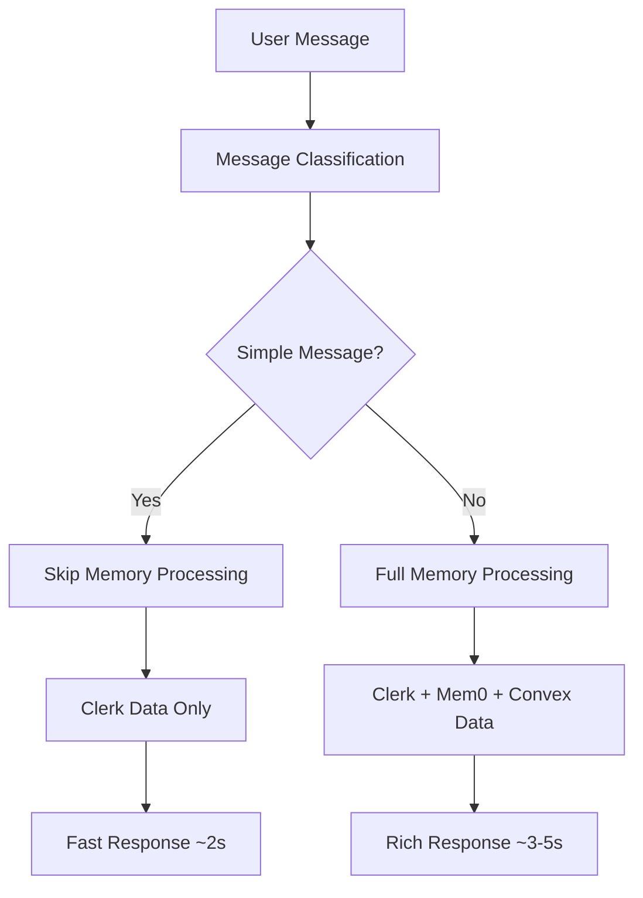

# AI Features Documentation

This document details the AI-powered features implemented in the Find Your Path application.

## Overview

The application uses a sophisticated AI system built on OpenAI GPT-4 Turbo with custom optimizations for performance and personalization.

## Smart Message Classification System

### Purpose
Automatically categorizes user messages to optimize response times by selectively applying memory processing only when necessary.

### Implementation
**File**: `/lib/message-classifier.ts`

```typescript
export enum MessageType {
  SIMPLE_GREETING = 'simple_greeting',     // "hi", "hello", "yo"
  ACKNOWLEDGMENT = 'acknowledgment',       // "ok", "thanks", "cool"
  PROFILE_SHARING = 'profile_sharing',     // Contains user info
  GOAL_SETTING = 'goal_setting',          // Contains aspirations
  OPPORTUNITY_REQUEST = 'opportunity_request', // Specific searches
  SUBSTANTIVE_QUESTION = 'substantive_question', // Complex queries
  FOLLOW_UP = 'follow_up'                  // Medium-length responses
}
```

### Classification Logic

#### Simple Messages (Skip Memory Processing)
- **SIMPLE_GREETING**: Exact matches for common greetings
- **ACKNOWLEDGMENT**: Short confirmations and thanks

#### Complex Messages (Full Memory Processing)
- **PROFILE_SHARING**: Contains keywords like "i am", "my major", "first year"
- **GOAL_SETTING**: Contains keywords like "want to", "hoping to", "goal"
- **OPPORTUNITY_REQUEST**: Contains keywords like "research", "internship", "grant"
- **SUBSTANTIVE_QUESTION**: Messages with 10+ words or complex sentences
- **FOLLOW_UP**: Medium-length messages (4-9 words)

### Performance Impact

| Message Type | Example | Processing Time | Memory Processing |
|--------------|---------|-----------------|-------------------|
| Simple Greeting | "yo" | ~2 seconds | ❌ Skipped |
| Acknowledgment | "thanks" | ~2 seconds | ❌ Skipped |
| Profile Sharing | "I'm a first-year CS major" | ~3-4 seconds | ✅ Full |
| Goal Setting | "I want to do research" | ~3-4 seconds | ✅ Full |
| Opportunity Request | "find me internships" | ~4-6 seconds | ✅ Full |

## Immediate Personalization System

### Purpose
Provides instant personalization using Clerk authentication data from the very first message.

### Implementation
**File**: `/app/api/chat/route.ts` (lines 68-137)

### Data Sources

#### From Clerk's `currentUser()`
```typescript
const clerkUser = await currentUser()

// Available data:
- firstName: string
- lastName: string
- emailAddresses: Array<{ emailAddress: string }>
- createdAt: Date
```

#### Derived Context
```typescript
const firstName = clerkUser.firstName || 'there'
const fullName = `${firstName}${lastName ? ' ' + lastName : ''}`
const email = clerkUser.emailAddresses?.[0]?.emailAddress || ''
const isDartmouthEmail = email.includes('@dartmouth.edu')
const accountAge = Math.floor((Date.now() - createdAt) / (1000 * 60 * 60 * 24))
const isNewUser = accountAge < 7
const isFirstConversation = messages.length <= 1
```

### Personalization Context Injection

The system injects an "IMMEDIATE CONTEXT" section into the AI prompt:

```
IMMEDIATE CONTEXT:
- Student name: Sarah Johnson
- Email verification: Confirmed Dartmouth student (@dartmouth.edu)
- Account status: New user (3 days old)
- Session type: First conversation

Use their name naturally in responses. Welcome them warmly as a new user.
Reference their confirmed Dartmouth status when relevant.
```

### Response Examples

#### New Dartmouth Student (First Conversation)
**Input**: "hi"
**Old Response**: "Hey there! What's up? How can I help you today at Dartmouth?"
**New Response**: "Hey Sarah! Welcome to Dartmouth! What's up? Since you're a confirmed Dartmouth student, I'm here to help you discover all the amazing opportunities on campus. What are you curious about?"

#### Returning Student
**Input**: "hello"
**Old Response**: "Hello! How can I assist you with finding opportunities?"
**New Response**: "Hey Alex! Good to see you back! How can I help you explore more opportunities today?"

#### Non-Dartmouth Email
**Input**: "hi"
**Response**: "Hey Jordan! Thanks for checking out Find Your Path! While this platform is designed for Dartmouth students, I'd be happy to help you learn about the opportunities here."

## Memory Management Strategy

### Dual-Layer Architecture

#### Layer 1: Immediate Context (Clerk Data)
- **Source**: Clerk authentication
- **Availability**: Instant (single API call)
- **Data**: Name, email verification, account age, session type
- **Purpose**: Immediate recognition and personalization

#### Layer 2: Contextual Memory (Mem0 + Convex)
- **Source**: Conversation history + user-provided information
- **Availability**: Builds over time
- **Data**: Interests, goals, academic info, previous topics
- **Purpose**: Deep personalization and context retention

### Processing Flow



## Performance Monitoring

### Logging System

#### Classification Logs
```bash
[Memory Classification] Message: "yo..." | Type: acknowledgment | Skip Memory: true | Reason: Simple greeting detected
```

#### Performance Logs
```bash
[Performance] Memory processing took: 0ms | Skip: true
[Performance] Total response time: 1750ms | Classification: acknowledgment
```

#### Personalization Logs
```bash
[Immediate Personalization] Applied for Sarah Johnson | Dartmouth: true | New: false | First chat: true
```

### Metrics Tracked

- **Response Time**: Total time from request to completion
- **Memory Processing Time**: Time spent on Mem0 operations
- **Classification Accuracy**: Manual verification of message categorization
- **Personalization Rate**: Percentage of messages with successful Clerk data injection

## Error Handling

### Graceful Degradation

#### Clerk Data Unavailable
```typescript
try {
  // Process Clerk user data
} catch (error) {
  console.error('[Immediate Personalization] Error processing Clerk user data:', error)
  // Continue without immediate personalization
}
```

#### Memory Processing Failures
- System continues with basic responses if Mem0 is unavailable
- Classification system has fallback logic for edge cases
- All errors are logged for debugging

### Fallback Strategies

1. **No Clerk Data**: Use generic greeting without name
2. **Classification Uncertainty**: Default to full memory processing
3. **Memory System Down**: Use immediate context only
4. **Complete AI Failure**: Static error message with retry option

## Configuration

### Environment Variables
```env
OPENAI_API_KEY=your_openai_key
CLERK_SECRET_KEY=your_clerk_secret
MEM0_API_KEY=your_mem0_key
```

### Tunable Parameters

#### Classification Thresholds
```typescript
// In message-classifier.ts
const isNewUser = accountAge < 7  // Days for "new user" status
const complexMessageLength = 10   // Words for "substantive" classification
const confidenceThreshold = 0.6   // Minimum confidence for memory processing
```

#### Performance Limits
```typescript
// In route.ts
timeout: 30000,        // Max response time (30s)
temperature: 0.7,      // AI creativity level
maxTokens: 1000       // Max response length
```

## Future Enhancements

### Planned Features

1. **Adaptive Classification**: Machine learning-based message categorization
2. **Context Awareness**: Cross-session conversation continuity
3. **Preference Learning**: Automatic personalization based on interaction patterns
4. **Performance Analytics**: Real-time dashboard for system metrics

### Optimization Opportunities

1. **Caching**: Cache Clerk user data for repeat requests
2. **Batching**: Group multiple message classifications
3. **Streaming**: Progressive response building for long answers
4. **Compression**: Reduce memory context size for faster processing