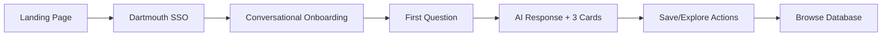
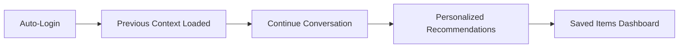

# Find Your Path — Product Requirements Document (PRD) v1.0 Enhanced

## 1. Executive Summary

**Problem:** Many Dartmouth students (especially first-gen/international) don't know what opportunities exist or how to start (professors, offices, grants).

**Solution:** An AI-powered conversational discovery platform that suggests programs based on year/interests/goals, explains how research works at Dartmouth, and provides concrete next steps with official links.

**Key Differentiator:** Not just a search tool but an educational, confidence-building companion that helps students discover opportunities they didn't know existed.

## 2. Goals & Non-Goals

### Goals (MVP)
* **G1:** Students can describe themselves in plain English and receive **3 relevant program cards** with concrete next steps + official links
* **G2:** Students can **browse** a lightweight database with smart filters (Year, Area, International-friendly, Department, Type)
* **G3:** Students can **save** (bookmark) items with persistent storage across sessions
* **G4:** Students feel **reassured** through empathetic AI responses that explain Dartmouth-specific contexts
* **G5:** App access is **Dartmouth .edu email gated** with secure authentication
* **G6:** Conversations have **persistent memory** that remembers user context across sessions

### Non-Goals
* **N1:** No deadline tracking, reminders, or calendar integrations
* **N2:** No application routing or form submission on behalf of students
* **N3:** No guarantees of outcomes; not an official Dartmouth channel
* **N4:** No financial aid calculations or sensitive data processing

## 3. Technical Architecture

### 3.1 Frontend Stack
* **Framework:** Next.js 14+ with App Router
* **UI Components:** shadcn/ui (Radix UI primitives + Tailwind CSS)
* **Styling:** Tailwind CSS v4 with custom animations
* **Forms:** react-hook-form with Zod validation
* **State Management:** Convex real-time subscriptions
* **AI Integration:** Vercel AI SDK with useChat hook

### 3.2 Backend Infrastructure
* **Primary Backend:** Convex (real-time database + serverless functions)
  - Document-based database with TypeScript schemas
  - Real-time reactive updates without manual state management
  - Built-in file storage for user profiles and saved items
  - Scheduled functions for data refresh and maintenance
  
* **AI Processing:** Vercel AI SDK Core
  - Multi-provider support (OpenAI GPT-4, Claude 3.5, etc.)
  - Streaming responses with backpressure handling
  - Tool calling for structured data retrieval
  - Rate limiting and usage tracking

### 3.3 Memory & Personalization Layer
* **Memory System:** Mem0 Integration
  - 26% accuracy boost in contextual responses
  - 91% lower p95 latency through selective retrieval
  - 90% token savings vs full-context methods
  - Persistent user profiles and conversation history
  - Semantic memory for concept organization
  - Episodic memory for specific interactions

### 3.4 Data Pipeline
* **Opportunity Database:** Airtable → Convex sync
  - Initial manual curation of 50+ programs
  - Firecrawl for automated scraping of official pages
  - Daily sync via Convex scheduled functions
  - Version control for opportunity updates

## 4. Core Features (Detailed Implementation)

### 4.1 Conversational AI Interface

#### Technical Implementation
```typescript
// Using Vercel AI SDK with Convex backend
const { messages, input, handleSubmit, isLoading } = useChat({
  api: '/api/chat',
  initialMessages: [],
  onFinish: async (message) => {
    // Store in Convex for persistence
    await ctx.db.insert("conversations", {
      userId,
      message,
      timestamp: Date.now()
    });
    // Update Mem0 memory
    await mem0.add(message, userId);
  }
});
```

#### Features
* **Streaming Responses:** Real-time token streaming with status indicators
* **Context Awareness:** Mem0 retrieves relevant past interactions
* **Smart Clarification:** Maximum 1 follow-up question before providing value
* **Research Explainer:** Triggered automatically for research-related queries
* **Tone Adaptation:** Adjusts formality based on user's communication style

### 4.2 Recommendation Engine

#### Algorithm
1. **Profile Extraction:** Parse user input for year, major, interests, goals
2. **Semantic Search:** Vector similarity search in Convex
3. **Filtering:** Apply hard filters (international status, year eligibility)
4. **Ranking:** Score based on:
   - Profile match (40%)
   - Popularity/success rate (20%)
   - Recency of opportunity (20%)
   - Diversity of options (20%)
5. **Presentation:** Format as structured cards with actions

#### Card Schema Enhancement
```typescript
interface OpportunityCard {
  id: string;
  title: string;
  department: string;
  eligibility: {
    years: string[];
    majors: string[];
    internationalFriendly: boolean;
    gpaRequirement?: number;
  };
  description: string;
  nextSteps: string[]; // 1-3 action items
  officialUrl: string;
  contact?: {
    role: string;
    name?: string;
    email?: string;
  };
  tags: Tag[];
  metrics?: {
    applicants: number;
    acceptanceRate?: number;
    averageAward?: number;
  };
  lastUpdated: Date;
}
```

### 4.3 Browse & Discovery

#### Implementation
* **Real-time Filtering:** Convex reactive queries
* **Faceted Search:** Multiple filter combinations
* **Smart Defaults:** Pre-populate from conversation context
* **Infinite Scroll:** Pagination with virtual scrolling
* **Quick Actions:** Save, share, report outdated info

### 4.4 Authentication & Onboarding

#### Flow
1. **Landing Page:** Value proposition + "Sign in with Dartmouth"
2. **OAuth Flow:** Clerk auth with Dartmouth SSO
3. **Profile Builder:** 
   - Conversational onboarding (not forms)
   - "I don't know" as valid response
   - Skip option available
4. **Welcome Tutorial:** Interactive tour of features

#### Security
* JWT tokens with 24hr expiry
* Rate limiting per user (100 messages/day)
* Bot protection via Vercel's x-is-human headers
* Sensitive data encryption at rest

### 4.5 Analytics & Monitoring

#### User Analytics (Privacy-Compliant)
```typescript
// Tracked via Convex + Vercel Analytics
interface UserMetrics {
  uniqueUsers: number;
  messagesPerSession: number;
  cardClickThroughRate: number;
  saveRate: number;
  returnUserRate: number;
  averageSessionDuration: number;
}
```

#### System Monitoring
* Vercel AI SDK telemetry for model performance
* Convex dashboard for real-time metrics
* Error tracking via Sentry
* Uptime monitoring via Better Stack

## 5. User Experience Flows

### 5.1 First-Time User Journey


### 5.2 Returning User Journey


## 6. Performance Requirements

### Response Times
* **Initial Load:** < 2s (Next.js SSG/ISR)
* **AI Response Start:** < 1s (streaming)
* **Full Response:** < 5s for 3 cards
* **Database Queries:** < 100ms (Convex indexes)
* **Memory Retrieval:** < 200ms (Mem0 optimization)

### Scale Requirements
* Support 5,000 concurrent users
* Handle 50,000 messages/day
* Store 1M conversation turns
* Index 500+ opportunities

## 7. Content Management

### Opportunity Data Pipeline
1. **Initial Seed:** Manual curation of top 50 programs
2. **Automated Scraping:** 
   - Firecrawl weekly crawl of official sites
   - Change detection and alerts
3. **Community Contributions:**
   - User submission form
   - Moderation queue in Convex
   - Automated quality checks
4. **Quality Assurance:**
   - Broken link detection
   - Outdated information flags
   - User reporting system

## 8. AI Model Configuration

### Primary Model
* **Provider:** OpenAI or Anthropic Claude
* **Model:** GPT-4-turbo or Claude-3.5-sonnet
* **Temperature:** 0.7 for conversational, 0.3 for factual
* **Max Tokens:** 1000 per response
* **System Prompt:** Detailed Dartmouth context + tone guide

### Fallback Strategy
```typescript
const modelHierarchy = [
  { provider: 'anthropic', model: 'claude-3-5-sonnet' },
  { provider: 'openai', model: 'gpt-4-turbo' },
  { provider: 'openai', model: 'gpt-3.5-turbo' } // Emergency fallback
];
```

## 9. Testing Strategy

### Unit Testing
* Component testing with Vitest
* API endpoint testing
* Convex function testing

### Integration Testing
* End-to-end flows with Playwright
* AI response quality checks
* Memory persistence validation

### Performance Testing
* Load testing with k6
* Latency monitoring
* Token usage optimization

## 10. Deployment & DevOps

### Infrastructure
* **Hosting:** Vercel (Next.js) + Convex Cloud
* **CDN:** Vercel Edge Network
* **Monitoring:** Vercel Analytics + Convex Dashboard
* **CI/CD:** GitHub Actions → Vercel Deploy

### Environments
1. **Development:** Local with Convex dev deployment
2. **Staging:** Preview deployments on Vercel
3. **Production:** Production deployments with rollback capability

## 11. Success Metrics

### Key Performance Indicators (KPIs)
* **User Engagement:**
  - Daily Active Users (DAU): Target 500 by month 3
  - Messages per session: Target 5+
  - Return rate: Target 40% weekly
* **Discovery Metrics:**
  - Cards clicked: Target 60% CTR
  - Programs saved: Target 2+ per user
  - Official links visited: Target 80% of saved
* **Quality Metrics:**
  - User satisfaction: Target 4.5/5
  - Response relevance: Target 85%
  - Technical accuracy: Target 95%

## 12. Launch Strategy

### Phase 1: Soft Launch (Week 1-2)
* 50 beta users (mix of years/majors)
* Core features only
* Rapid iteration on feedback

### Phase 2: Campus Launch (Week 3-4)
* Marketing through student organizations
* Professor/advisor endorsements
* Social media campaign

### Phase 3: Full Launch (Week 5+)
* All features enabled
* Continuous improvement
* Community features activated

## 13. Risk Mitigation

### Technical Risks
* **AI Hallucination:** Strict factual grounding + official link verification
* **Rate Limits:** Caching + request queuing + fallback models
* **Data Staleness:** Automated freshness checks + user reporting

### Operational Risks
* **Support Load:** Self-service help + FAQ bot
* **Content Moderation:** Automated filters + review queue
* **Cost Overruns:** Usage caps + efficient token management

## 14. Future Enhancements (Post-MVP)

### Phase 2 Features
* Wall of Advice from upperclassmen
* Professor matching algorithm
* Group discovery sessions
* Mobile app (React Native)

### Phase 3 Features
* Application tracking dashboard
* Peer mentorship matching
* Success story showcases
* Integration with Dartmouth systems

## 15. Appendices

### A. Technology Decisions Rationale
* **Convex over traditional DB:** Real-time sync crucial for chat UX
* **Mem0 over simple storage:** 90% token savings at scale
* **Vercel AI SDK:** Best-in-class streaming + multi-provider support
* **Next.js 14:** App Router for better performance + RSC support

### B. Competitive Analysis
* **DartHub:** Static directory, no personalization
* **UGAR Site:** Comprehensive but overwhelming
* **ChatGPT:** No Dartmouth-specific knowledge
* **Our Advantage:** Contextual + personalized + actionable

### C. Compliance & Legal
* FERPA compliance for student data
* Accessibility (WCAG 2.1 AA)
* Terms of Service disclaimer
* Privacy policy with data retention details